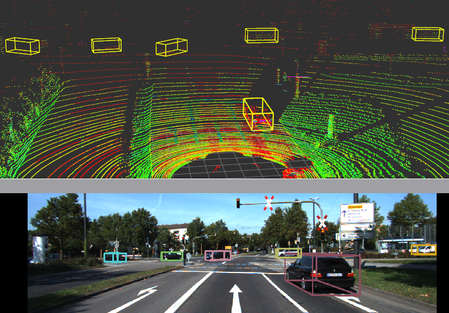

# Introduction
Ability to detect cars in any KITTI rosbag using PointRCNN detections. Able to visualize in image and LiDAR space. 

 

# Requirements
* Ubuntu 18.04
* Pytorch 1.0
* ROS Melodic 
* Python 3+
* Rosbag
* Pre - trained model

# Prepare environment

It is recommended to create a virtual environment.

`python3 -m venv path/to/virtual/env/name`

`source path/to/virtual/env/name/bin/activate`

Create catkin workspace.

`mkdir -p ~/catkin_ws/src`

`cd ~/catkin_ws/src`

Clone repo, and include the submodules

`git clone --recursive https://github.com/dmatos2012/pointrcnn_detector_ros.git`

Once you have the venv setup, install python 3 requirements, in the root folder(/pointrcnn_detector_ros)

`pip install -r requirements.txt`

Additionally, you need to build extra PointRCNN libraries (iou3d, pointnet2, roipool3d)

`cd src/PointRCNN/`

`sh build_and_install.sh` 

Then run the script to build the environment with cv bridge and python3.

`cd ~/catkin_ws`

`sh src/pointrcnn_detector_ros/configure_environment.sh path/to/virtual/env/name/bin/python`

`source devel/setup.bash`

# Data Preparation

* ROSBAG: In order to convert a KITTI raw data to a rosbag, check out [kitti2bag](https://github.com/tomas789/kitti2bag). Although you can download the one I used [here](https://drive.google.com/file/d/1y9bqJl-6u2OfhRoMTFuxE807nA5VtWou/view?usp=sharing). 

    Place the rosbag in pointrcnn_detector_ros/data/kitti_2011_09_26_drive_0011_synced.bag

    For now, I have hardcoded the launch of this specific rosbag, but you can just modify the roslaunch file and change it to your own rosbag. If you use a different rosbag, make sure you also change the calibration file to match that specific rosbag.

* Pre-trained model: You can obtained pre - trained model from the PointRCNN repo [here](https://drive.google.com/file/d/1aapMXBkSn5c5hNTDdRNI74Ptxfny7PuC/view). 

    Place the pre-trained model in pointrcnn_detector_ros/src/PointRCNN/tools/PointRCNN.pth 

# Visualize

Launch visualization with

`roslaunch prcnn_ros kitti_car_det.launch`

# Acknowledgements
[PointRCNN](https://github.com/sshaoshuai/PointRCNN) for the amazing object detector and their publicly available pre-trained model and code. 

[Kitti2bag](https://github.com/tomas789/kitti2bag) for tool to convert KITTI raw data to rosbag

